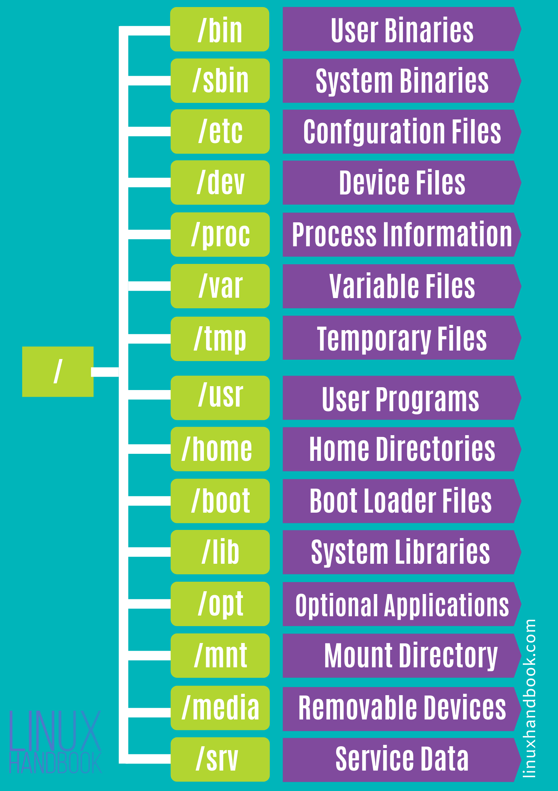

# lx_start

Курс "Линукс для администраторов": started 2023 march 31

Введение в Linux: +

История Linux; nope - эмблема линукс это пингвин нарисован 1996 - линукс это свободное пое распростроняется бесплатно/ GPL тип лицензии означающий что исходний код может увидеть любой пользователь +

Основные понятия; +

Различия между Linux и другими операционными системами.
Debian, Ubuntu, centos, redhat, oraclelinux
Установка и настройка Linux:
Выбор дистрибутива Linux;  на основе документации и LTS версий +

Установка Linux на компьютер; линукс есть для десктоп и для серверов/

Основные настройки системы.
Командная строка Linux: +
Работа с файловой системой;

/ – The root directory

**/bin – Binaries**

The ‘/bin’ directly contains the executable files of many basic shell commands like ls, cp, cd etc. Mostly the programs are in binary format here and accessible by all the users in the Linux system.

**/dev – Device files**

This directory only contains special files, including those relating to the devices. These are virtual files, not physically on the disk.

Some interesting examples of these files are:

/dev/null: can be sent to destroy any file or string
/dev/zero: contains an infinite sequence of 0
/dev/random: contains an infinite sequence of random values

Команды для работы с файлами и директориями;

Работа с процессами;

Основы регулярных выражений.
Администрирование Linux:
Управление пользователями и группами;

Настройка сети;

Управление пакетами;

Резервное копирование и восстановление.
Linux для серверов:
Установка и настройка серверных приложений (Apache, MySQL, PostgreSQL, и т.д.);

Конфигурация и обслуживание веб-сервера;

Обеспечение безопасности сервера.
Курс "Линукс веб-сервер администратор":

Основы Linux для веб-серверов:
История Linux для веб-серверов;

Основные понятия;

Различия между Linux и другими операционными системами для веб-серверов.
Установка и настройка Linux для веб-серверов:
Выбор дистрибутива Linux для веб-серверов;

Установка Linux для веб-серверов на компьютер;

Основные настройки системы.
Администрирование веб-сервера:
Установка и настройка веб-сервера Apache;

Настройка виртуальных хостов;

Работа с модулями Apache;

Настройка SSL и HTTPS.
Базы данных на веб-серверах:
Установка и настройка базы данных MySQL;

Основы работы с базой данных MySQL;

Настройка соединения с базой данных.
Обеспечение безопасности веб-сервера:
Настройка файрвола;

Ограничение доступа к файлам;

Мониторинг и журналирование;

Защита от атак.

Курсы могут быть дополнены и изменены в зависимости от уровня сложности и потребностей