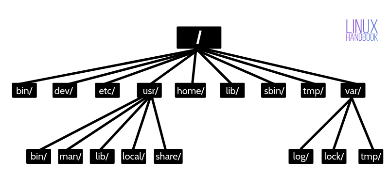

# lx_start

Курс "Линукс для администраторов": started 2023 march 31

Введение в Linux: +

История Linux; nope - эмблема линукс это пингвин нарисован 1996 - линукс это свободное пое распростроняется бесплатно/ GPL тип лицензии означающий что исходний код может увидеть любой пользователь +

Основные понятия; +

Различия между Linux и другими операционными системами.
Debian, Ubuntu, centos, redhat, oraclelinux
Установка и настройка Linux:
Выбор дистрибутива Linux;  на основе документации и LTS версий +

Установка Linux на компьютер; линукс есть для десктоп и для серверов/

Основные настройки системы.
Командная строка Linux: +
Работа с файловой системой;

/ – The root directory

>**/bin – Binaries**

The ‘/bin’ directly contains the executable files of many basic shell commands like ls, cp, cd etc. Mostly the programs are in binary format here and accessible by all the users in the Linux system.

>**/dev – Device files**

This directory only contains special files, including those relating to the devices. These are virtual files, not physically on the disk.

Some interesting examples of these files are:

/dev/null: can be sent to destroy any file or string
/dev/zero: contains an infinite sequence of 0
/dev/random: contains an infinite sequence of random values

>**/etc – Configuration files

The /etc directory contains the core configuration files of the system, use primarily by the administrator and services, such as the password file and networking files.

If you need to make changes in system configuration (for example, changing the hostname), this is where you’ll find the respective files.

>**/usr – User binaries and program data

in ‘/usr’ go all the executable files, libraries, source of most of the system programs. For this reason, most of the files contained therein is read­only (for the normal user)

‘/usr/bin’ contains basic user commands
‘/usr/sbin’ contains additional commands for the administrator
‘/usr/lib’ contains the system libraries
‘/usr/share’ contains documentation or common to all libraries, for example ‘/usr/share/man’ contains the text of the manpage

>**/home – User personal data

Home directory contains personal directories for the users. The home directory contains the user data and user-specific configuration files. As a user, you’ll put your personal files, notes, programs etc in your home directory.

>**/lib – Shared libraries

Libraries are basically codes that can be used by the executable binaries. The /lib directory holds the libraries needed by the binaries in /bin and /sbin directories.

Libraries needed by the binaries in the /usr/bin and /usr/sbin are located in the directory /usr/lib.

>**/sbin – System binaries

This is similar to the /bin directory. The only difference is that is contains the binaries that can only be run by root or a sudo user. You can think of the ‘s’ in ‘sbin’ as super or sudo.

>**/tmp – Temporary files

As the name suggests, this directory holds temporary files. Many applications use this directory to store temporary files. Even you can use directory to store temporary files.

But do note that the contains of the /tmp directories are deleted when your system restarts. Some Linux system also delete files old files automatically so don’ store anything important here.

>**/var – Variable data files

Var, short for variable, is where programs store runtime information like system logging, user tracking, caches, and other files that system programs create and manage.

The files stored here are NOT cleaned automatically and hence it provides a good place for system administrators to look for information about their system behavior. For example, if you want to check the login history in your Linux system, just check the content of the file in /var/log/wtmp.

>**/boot – Boot files

The ‘/boot’ directory contains the files of the kernel and boot image, in addition to LILO and Grub. It is often advisable that the directory resides in a partition at the beginning of the disc.

>**/proc – Process and kernel files

The ‘/proc’ directory contains the information about currently running processes and kernel parameters. The content of the proc directory is used by a number of tools to get runtime system information.

For example, if you want to check processor information in Linux, you can simply refer to the file /proc/cpuinfo. You want to check memory usage of your Linux system, just look at the content of /proc/meminfo file.

>**/opt – Optional software

Traditionally, the /opt directory is used for installing/storing the files of third-party applications that are not available from the distribution’s repository.

The normal practice is to keep the software code in opt and then link the binary file in the /bin directory so that all the users can run it.

>**/root – The home directory of the root

There is /root directory as well and it works as the home directory of the root user. So instead of /home/root, the home of root is located at /root. Do not confuse it with the root directory (/).

>**/media – Mount point for removable media

When you connect a removable media such as USB disk, SD card or DVD, a directory is automatically created under the /media directory for them. You can access the content of the removable media from this directory.

>**/mnt – Mount directory

This is similar to the /media directory but instead of automatically mounting the removable media, mnt is used by system administrators to manually mount a filesystem.

>**/srv – Service data

The /srv directory contains data for services provided by the system. For example, if you run a HTTP server, it’s a good practice to store the website data in the /srv directory.

Команды для работы с файлами и директориями;

Работа с процессами;

Основы регулярных выражений.
Администрирование Linux:
Управление пользователями и группами;

Настройка сети;

Управление пакетами;

Резервное копирование и восстановление.
Linux для серверов:
Установка и настройка серверных приложений (Apache, MySQL, PostgreSQL, и т.д.);

Конфигурация и обслуживание веб-сервера;

Обеспечение безопасности сервера.
Курс "Линукс веб-сервер администратор":

Основы Linux для веб-серверов:
История Linux для веб-серверов;

Основные понятия;

Различия между Linux и другими операционными системами для веб-серверов.
Установка и настройка Linux для веб-серверов:
Выбор дистрибутива Linux для веб-серверов;

Установка Linux для веб-серверов на компьютер;

Основные настройки системы.
Администрирование веб-сервера:
Установка и настройка веб-сервера Apache;

Настройка виртуальных хостов;

Работа с модулями Apache;

Настройка SSL и HTTPS.
Базы данных на веб-серверах:
Установка и настройка базы данных MySQL;

Основы работы с базой данных MySQL;

Настройка соединения с базой данных.
Обеспечение безопасности веб-сервера:
Настройка файрвола;

Ограничение доступа к файлам;

Мониторинг и журналирование;

Защита от атак.

Курсы могут быть дополнены и изменены в зависимости от уровня сложности и потребностей